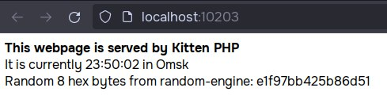

# Kitten DB + Kitten PHP
Old VK "engines" from 2014

## Building
Requirements: libz, libre2, libpcre, openssl and scons.

```
$ scons
$ cd kphp_program
$ ./build.sh
```

## Running a simple KPHP program
```
$ ./random-engine -vvvv -p 11211 ./random.bin &
$ ./kphp_program/build/main -q -H 10203
```

Результат:  

